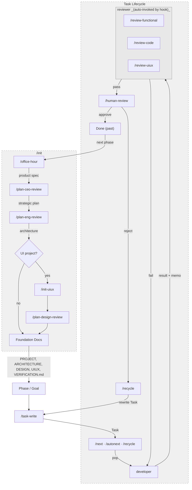

# MPM Workflow

## 1. Project Lifecycle



## 2. Agents

| Agent | Role | Execution |
|-------|------|-----------|
| **Planner** | Foundation docs, phase/goal management, task creation | `claude --agent mpm-planner` |
| **Developer** | Task execution: pop, implement, fill result | `claude --agent mpm-developer` |
| **Reviewer** | Independent verification (functional, code, uiux) | Auto-invoked by hook via SendMessage — no manual invocation needed |
| **Human** | Final judgment: approve / reject / discard | Via dashboard or `/human-review` |

**Parallel execution recommended.** Run planner and developer as separate `--agent` sessions to maintain clear context separation — mixing planning and development in one session leads to context pollution for both humans and AI.

## 3. Skills Reference

| Skill | Agent | Description |
|-------|-------|-------------|
| `/init` | Planner | Full project initialization (runs sub-skills below) |
| `/office-hour` | Planner | Product definition — forcing questions, product spec |
| `/plan-ceo-review` | Planner | Strategic review — scope, vision, premises |
| `/plan-eng-review` | Planner | Engineering review — architecture, tests, edge cases |
| `/plan-design-review` | Planner | Design plan review — rates and fixes UIUX.md |
| `/init-uiux` | Planner | UI/UX foundation — DESIGN.md, tokens, UIUX.md |
| `/task-write` | Planner, Developer | Create well-structured tasks |
| `/recycle` | Planner | Rewrite rejected tasks and return to queue |
| `/next` | Developer | Pop and start the next task |
| `/autonext` | Developer | Continuously process tasks from queue |
| `/review-functional` | Reviewer | Run verification, test unhappy paths |
| `/review-code` | Reviewer | Architecture compliance, DRY, security |
| `/review-uiux` | Reviewer | Design system + UX standards + visual verification |
| `/human-review` | Human | Final approval, rejection, or discard |

## 4. `.mpm/` Structure

```
.mpm/
├── mpm-workflow.md              # This file
├── docs/                        # Foundation documents
│   ├── PROJECT.md               # Product vision, target users, success criteria
│   ├── ARCHITECTURE.md          # System design, patterns, conventions
│   ├── DESIGN.md                # Visual design system
│   ├── UIUX.md                  # UI structure, screen flows, interaction states
│   ├── VERIFICATION.md          # Verification tools and commands
│   └── tokens/                  # Design tokens (colors, typography, spacing)
├── data/
│   ├── future.json              # Queued tasks
│   ├── current/                 # Tasks in progress (one per session)
│   ├── review/                  # Tasks awaiting human review
│   ├── past/                    # Completed tasks (YYMMDD.json)
│   └── FEEDBACK_HISTORY.md      # Rejected/needs-input review comments
├── gstack/                      # Product specs, sketches, CEO/eng plans
│   ├── design-*.md
│   ├── sketches/
│   └── ceo-plans/
└── scripts/
    ├── task.py                  # Task CRUD and lifecycle management
    ├── phase.py                 # Phase and goal management
    ├── inject-project-status.sh # Shared context injection (SessionStart hook)
    └── hook-*.sh                # Lifecycle hooks
```

## 5. Rules

- **All task operations go through `task.py`** — never read/write `.mpm/data/` JSON directly.
- **All task creation uses `/task-write`** — never write task fields manually.
- **Developer never calls `task.py complete`** — only humans move tasks to past.
- Use `${CLAUDE_SESSION_ID}` for session identification — do NOT parse log files.
- Append new tasks to the **back** of future.json.
- One task per session in current.
- Always respond in the user's language.
